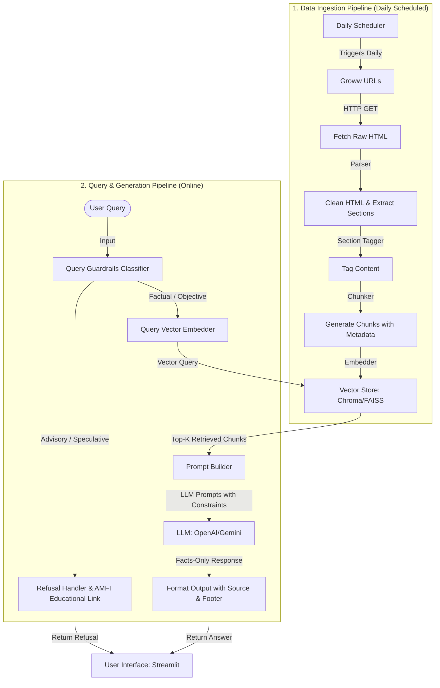

# System Architecture: Mutual Fund FAQ Assistant (Facts-Only R&A)

This document describes the end-to-end system architecture of the Retrieval-Augmented Generation (RAG) assistant designed for factual, compliance-friendly Mutual Fund Q&A.

---

## 1. System Overview

The Mutual Fund FAQ Assistant uses a facts-only Retrieval-Augmented Generation (RAG) pipeline. Below is the high-level architecture showing how the daily-scheduled ingestion pipeline and the online user query pipeline interact:

```mermaid
graph LR
    subgraph Data Sources
        Groww[Groww Scheme Pages]
    end

    subgraph Data Ingestion Pipeline (Daily Scheduled)
        Scheduler[Daily Scheduler] -->|Triggers| Fetcher[Fetcher / Scraper]
        Fetcher -->|Raw Data| Parser[Parser & Tagger]
        Parser -->|Cleaned Sections| VectorStore[(Vector DB)]
    end

    subgraph User Query Pipeline (Online)
        User[User Interface] <-->|User Query / Response| Assistant[RAG Query Pipeline]
        VectorStore -->|Context Retrieval| Assistant
    end
```

### Detailed System Flow

The diagram below details the data flow from the target URLs into the Vector DB, and how user queries are processed and filtered by the Guardrails classifier before generating answers:



---

## 2. Component Specifications

### 2.1 Data Ingestion Pipeline
This module operates automatically on a **daily schedule** to keep the factual corpus database updated with the latest scheme details.

1. **Daily Ingestion Scheduler**
   - A scheduler (e.g., configured via Cron, GitHub Actions, or `apscheduler`) triggers the pipeline every 24 hours.
   - Automates the scraping process to ensure details like the latest NAV, expense ratio, or asset under management (AUM) are fresh.
2. **Scraper/Fetcher (`ingestion/fetch.py`)**
   - Performs HTTP GET requests for the 5 target Groww URLs.
   - Saves raw content and stores a `fetched_at` timestamp.
3. **Cleaner & Parser (`ingestion/parse.py`)**
   - Strips non-content page features (headers, footers, sidebars, navigation bars, ads).
   - Normalizes text and whitespace.
3. **Section Tagging & Extraction**
   - Categorizes and tags document blocks into the following standardized sections:
     - `overview`: General fund information.
     - `expense_ratio`: Fees and charges.
     - `exit_load`: Exit fee percentages and holding periods.
     - `minimum_investment`: Minimum SIP/lump sum amounts.
     - `benchmark`: Fund benchmark indices.
     - `tax`: Taxation rules for returns.
     - `fund_management`: Details about the fund manager(s), their credentials, and experience.
     - `investment_objective`: The primary goal of the fund.
     - `fund_house`: General AMC profile information.
4. **Chunking & Embedding**
   - Chunks content by sections (or standard character chunks with overlap if section lengths exceed token limits) to preserve context.
   - Enriches each chunk with metadata: `source_url`, `section_tag`, `last_updated_date` (derived from fetch timestamp).
   - Generates vector embeddings for each chunk.

### 2.2 Vector Storage and Retrieval
- **Database**: Lightweight vector database (e.g., ChromaDB or FAISS).
- **Search Strategy**: Cosine similarity / Vector distance based retrieval.
- **Filtering**: Supports metadata-based filtering (e.g., filtering retrieval to a specific scheme if mentioned in the query).

### 2.3 Query Guardrails & Classifier
To prevent financial advice liability, all incoming queries must pass through a strict classification layer.

- **Advisory/Speculative Queries**: Any query seeking investment advice ("Which fund is better?", "Should I buy...", "Will this fund double?") is immediately flagged and routed to the Refusal Handler.
- **Factual Queries**: Objective questions ("What is the expense ratio?", "Who is the fund manager?") are allowed to proceed.
- **Refusal Handler**: Polite response stating the system only provides factual data. It appends an official educational link (e.g., to AMFI or SEBI investor education pages).

### 2.4 Prompt Engineering & LLM Execution
The prompt ensures strict alignment with constraints:
- **Strict Grounding**: The LLM must answer *only* using the provided text context. If the answer is not in the context, it must state it cannot answer.
- **Length Constraint**: Maximum of 3 sentences.
- **Footer Requirement**: Appends `Last updated from sources: <date>` and the exact citation URL.

---

## 3. Data Schema

### 3.1 Vector Database Schema
Each document vector stored includes the following payload metadata:

| Field | Type | Description |
| :--- | :--- | :--- |
| `id` | String | Unique hash of the chunk |
| `text` | String | Raw text content of the chunk |
| `source_url` | String | Groww URL of the scheme page |
| `section_tag` | String | One of the 9 extraction tags (e.g., `fund_management`) |
| `last_updated` | String | ISO timestamp of the source ingestion date |

---

## 4. User Interface Architecture

A clean, responsive, and minimalist web interface built with **Streamlit** consisting of:
1. **Header/Welcome Message**: Simple title and orientation message.
2. **Factual Disclaimer (Always Visible)**: *"Facts-only. No investment advice."*
3. **Example Question Pills**: Quickly load typical factual questions:
   - *"What is the expense ratio of HDFC Small Cap Fund?"*
   - *"Who manages the HDFC Defence Fund?"*
   - *"Is there an exit load for HDFC Mid-Cap Opportunities Fund?"*
4. **Chat Interface**: Simple message input and output panel displaying the response with its source citation and footer.
